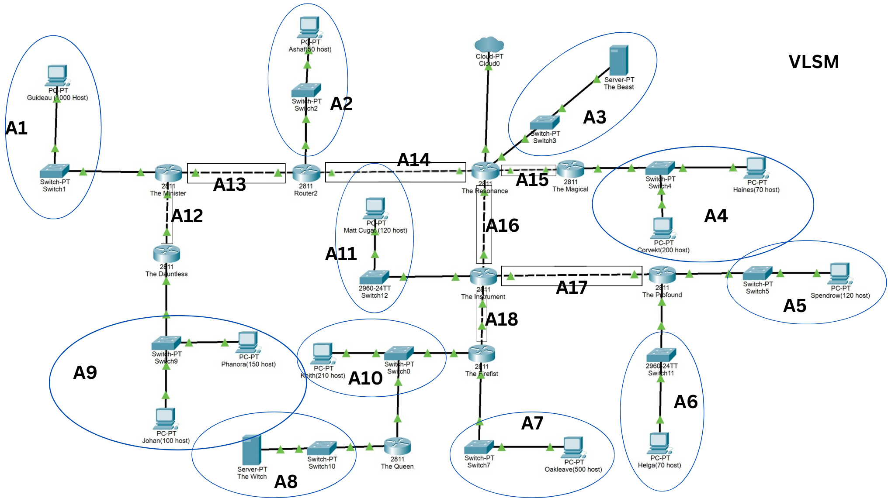
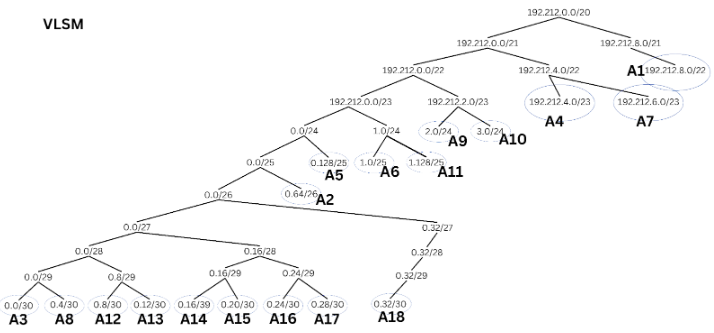
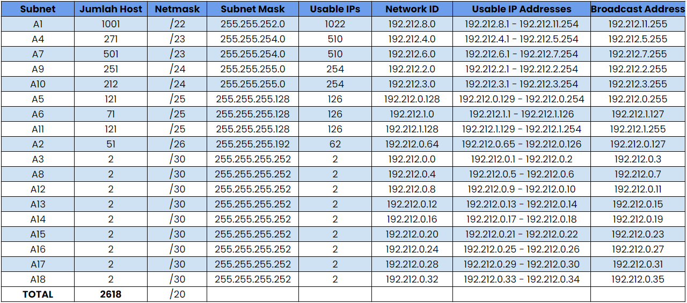

# Jarkom-Modul-4-ITA04-2022
Nama Anggota | NRP
------------------- | --------------		
Nida'ul Faizah | 5027201064
Kevin Oktoaria | 5027201046
Najwa Amelia Qorry 'Aina | 5027201001

## Soal
Topologi yang perlu kita buat :

1. Soal shift dikerjakan pada Cisco Packet Tracer dan GNS3 menggunakan metode perhitungan CLASSLESS yang berbeda.
2. Keterangan: Bila di CPT menggunakan VLSM, maka di GNS3 menggunakan CIDR atau Sebaliknya
3. Jika tidak ada pemberitahuan revisi soal dari asisten, berarti semua soal BERSIFAT BENAR dan DAPAT DIKERJAKAN.
4. Untuk di GNS3 CLOUD merupakan NAT1 jangan sampai salah agar bisa terkoneksi internet.
5. Pembagian IP menggunakan Prefix IP yang telah ditentukan pada modul pengenalan
6. Pembagian IP dan routing harus SE-EFISIEN MUNGKIN.

## Jawaban
### Metode VLSM
Pertama, kita menentukan subnet pada topologi. Lalu kita perlu melingkari host yang terhubung pada interface router serta menghitung IP yang dibutuhkan. Berikut merupakan pembagian subnet kami :

Kemudian kami menghitung jumlah host setiap subnet dan berapa netmask yang akan digunakan dengan perhitungan berikut:

Dengan Prefix IP kelompok ITA04 (192.212.x.x), kemudian kami mengerjakan perhitungan subnetting menggunakan metode VLSM dengan pohon perhitungan VLSM berikut:

Detail dari perhitungan dapat dilihat melalui tabel perhitungan berikut:

Selanjutnya kami melakukan konfigurasinya berdasarkan tabel perhitungan metode VLSM ini pada Cisco Packet Tracert.
