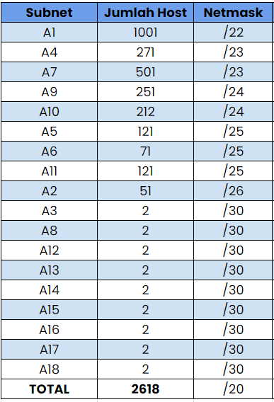
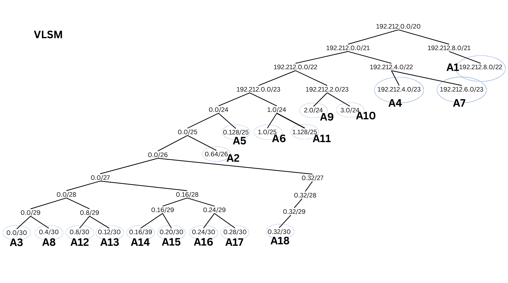
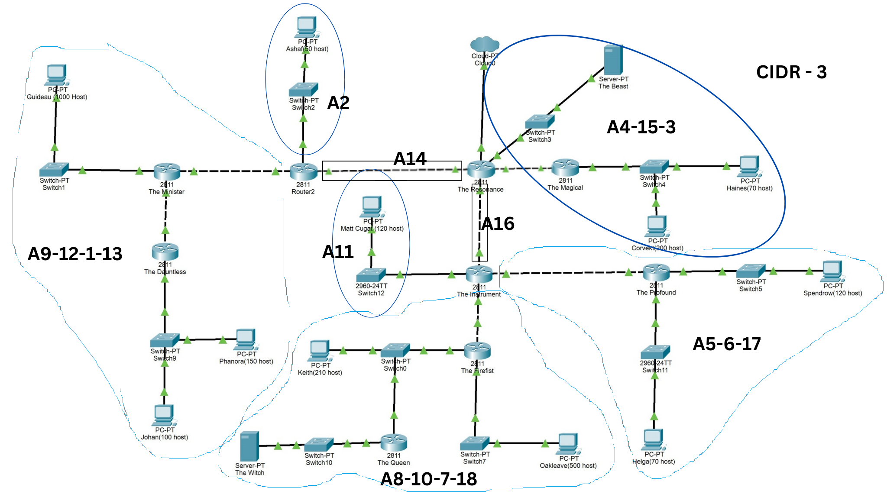
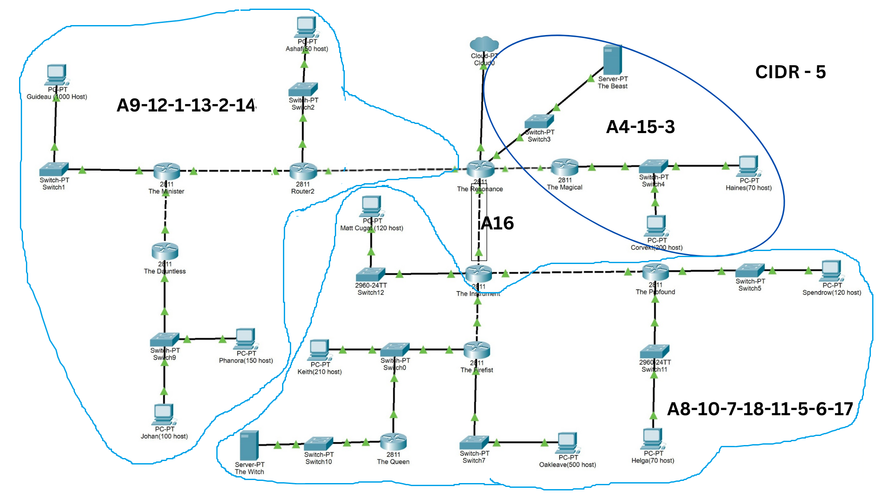
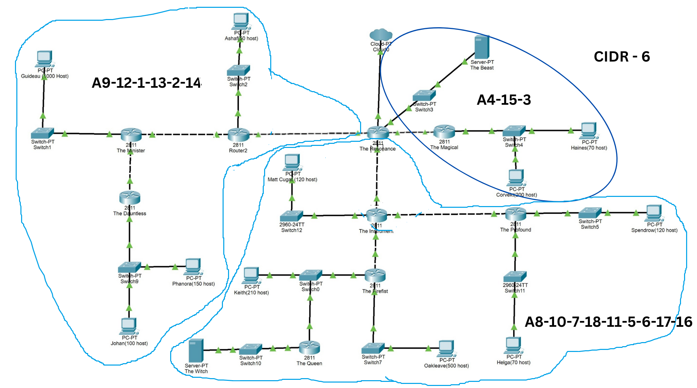

# Jarkom-Modul-4-ITA04-2022
Nama Anggota | NRP
------------------- | --------------		
Nida'ul Faizah | 5027201064
Kevin Oktoaria | 5027201046
Najwa Amelia Qorry 'Aina | 5027201001

## Soal
Topologi yang perlu kita buat :


1. Soal shift dikerjakan pada Cisco Packet Tracer dan GNS3 menggunakan metode perhitungan CLASSLESS yang berbeda.
2. Keterangan: Bila di CPT menggunakan VLSM, maka di GNS3 menggunakan CIDR atau Sebaliknya
3. Jika tidak ada pemberitahuan revisi soal dari asisten, berarti semua soal BERSIFAT BENAR dan DAPAT DIKERJAKAN.
4. Untuk di GNS3 CLOUD merupakan NAT1 jangan sampai salah agar bisa terkoneksi internet.
5. Pembagian IP menggunakan Prefix IP yang telah ditentukan pada modul pengenalan
6. Pembagian IP dan routing harus SE-EFISIEN MUNGKIN.

## Jawaban
### Metode VLSM
Pertama, kita menentukan subnet pada topologi. Lalu kita perlu melingkari host yang terhubung pada interface router serta menghitung IP yang dibutuhkan. Berikut merupakan pembagian subnet kami :


Kemudian kami menghitung jumlah host setiap subnet dan berapa netmask yang akan digunakan dengan perhitungan berikut:



Dengan Prefix IP kelompok ITA04 (192.212.x.x), kemudian kami mengerjakan perhitungan subnetting menggunakan metode VLSM dengan pohon perhitungan VLSM berikut:



Detail dari perhitungan dapat dilihat melalui tabel perhitungan berikut:


Selanjutnya kami melakukan konfigurasinya berdasarkan tabel perhitungan metode VLSM ini pada Cisco Packet Tracer. IP address diambil dari kolom Usable IP Addresses. Sebagai contoh kami mengambil subnet A1 sebagai berikut:

##### Pada The Minister: Router yang terhubung pada subnet A1


##### Pada Guideau: PC yang terdapat pada subnet A1


Untuk subnet lainnya dilakukan dengan cara yang sama. Lebih jelasnya dapat dilihat langsung pada packet tracer <a href="https://github.com/najwamelia/Jarkom-Modul-4-ITA04-2022/blob/main/Jarkom-Modul-4-ITA04-2022.pkt"><b style="color:blue">berikut</b></a>.

#### Routing VLSM
Setelah semua Node sudah diatur IP nya, selanjutnya kita akan melakukan routing agar semua node saling terhubung. Sebagai contoh penjelasan, kami mengambil router The Order. 

Pertama-tama kami menghubungkan router The Order ke internet melalui router The Resonance kemudian sambungkan ke subnet yang berada di bawah router yaitu subnet A1, A9, dan A12 melalui router The Minister dengan konfigurasi seperti berikut:

```
Internet:
	Network: 0.0.0.0
	Netmask: 0.0.0.0
	Next Hop: 192.212.0.17
Subnet A1:
	Network: 192.212.8.0
	Netmask: 255.255.252.0
	Next Hop: 192.212.0.14
Subnet A9:
    Network: 192.212.2.0
	Netmask: 255.255.255.0
	Next Hop: 192.212.0.14
Subnet A12:
	Network: 192.212.0.8
	Netmask: 255.255.255.252
	Next Hop: 192.212.0.14
```

Berikut adalah screenshot routing pada The Order:


Untuk routing lainnya dilakukan dengan cara yang sama. Lebih jelasnya dapat dilihat langsung pada packet tracer <a href="https://github.com/najwamelia/Jarkom-Modul-4-ITA04-2022/blob/main/Jarkom-Modul-4-ITA04-2022.pkt"><b style="color:blue">berikut</b></a>.

Dengan melakukan routing seperti itu, kita sudah dapat memastikan bahwa semua node sudah terhubung. Sebagai contoh kami mengambil The Dauntless ke The Profound. 


### Metode CIDR
Pada bagian ini kami menyelesaikan persoalan menggunakan metode CIDR dimana ketika satu subnet diturunkan, netmask yang akan terbentuk disesuaikan dengan penggabungan subnet yang telah dilakukan sebelumnya. Sebagai contoh, dari netmask besar /20, pada teknik VLSM akan dibagi dua menjadi masing-masing /21. Kali ini, pada penggabungan yang dilakukan dari teknik CIDR, /20 dihasilkan dari penggabungan /21 dan /25 maka subnet yang terbentuk memiliki netmask /21 dan /25.

Kami menghitung jumlah host setiap subnet dan berapa netmask yang akan digunakan dengan perhitungan berikut:


Pada metode CIDR ini kami melakukan penggabungan dengan 8 steps dari subnet paling bawah dengan ilustrasi sebagai berikut:

###### Step 0 - subnet awal


###### Step 1


###### Step 2


###### Step 3


###### Step 4


###### Step 5


###### Step 6


###### Step 7


###### Step 8


Kemudian, berikut adalah tabel perhitungan secara lengkap menggunakan teknik CIDR:


Adapun pohon perhitungannya terbentuk sebagai berikut:


